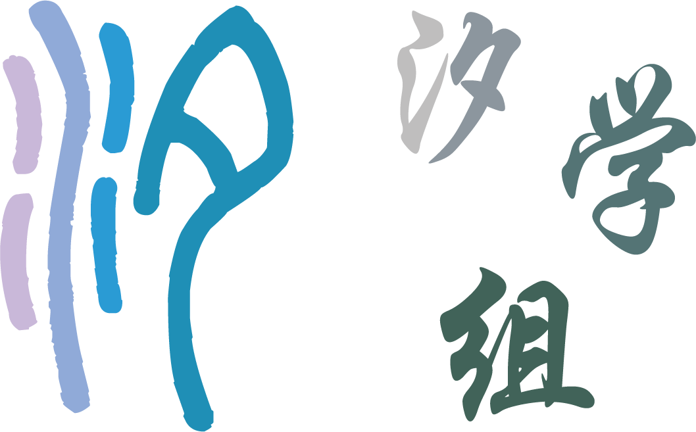
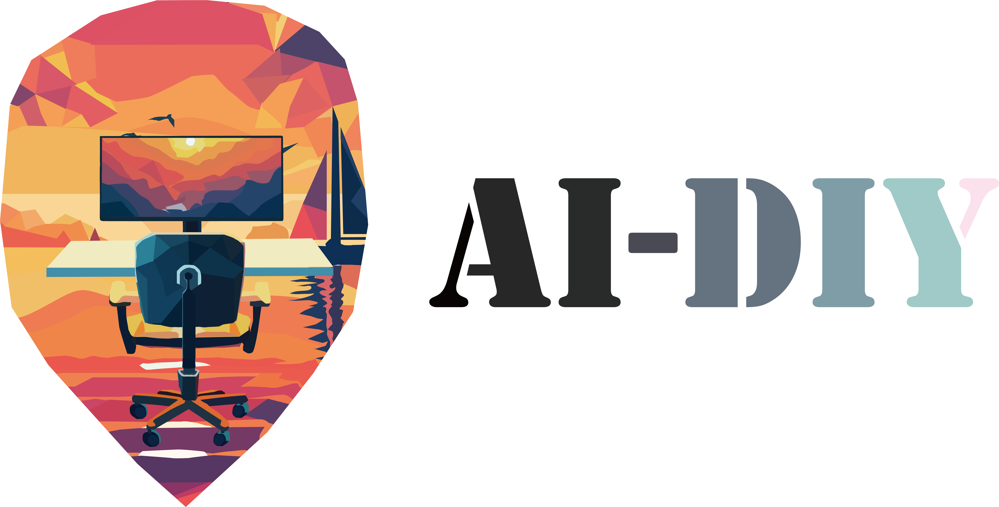

# 关于我们

这里是汐学组，一个致力于知识开源与分享的学生组织，并且正在努力扩大自己的影响力，以帮助到更多的人！

无论是教程/指南/复习资料，我们都有制作，并稳定产出！🎉

大多数内容将从之前的 QQ 群组缓慢迁移至 GitHub，并将 GitHub 作为将来资料的首发平台。

加入我们，学习各种知识，并使用 Markdown & $\LaTeX$ 制作资料，为开源社区贡献自己的力量。❤️

目前本组织的目标主要包括：

- 创作《西安交大生存指南》，旨在帮助西安交大新生与老生。
- 创作学科复习资料。
- 维护《人工智能自学指南》，旨在为人工智能初学者提供快速入门的途径。
- 更新《学点没用的》月刊，旨在为 CS/AI 领域学生/从业者提供可能不属于自己领域的优质教程，用于拓展知识面。

## 导航

### 西安交大生存指南

**\[ [主页](https://survivexjtu.github.io/) | [GitHub](https://github.com/XiStudyGroup/SurviveXJTU/) \]**

面向西安交通大学学生（尤其新生）的生存指南，关于人生/入校/学习/保研的全方位指南。

### AI Wiki

**\[ [主页](https://aidiy.icu) | [GitHub](https://github.com/Axi404/ai-self-learning/) \]**

AI Version的CS自学指南，如何自学人工智能，哪些教材/课程/视频可供参考或需要舍弃部分，如何提高自己的科研品味，如何快速入门某一领域等科研入门指导全覆盖。

### 学习资料

#### Released

**\[[链接](../学习资料/index.md)\]**

开源资料的PDF下载页，可下载全部资料的PDF版本，全部资料使用[Typora](https://typora.io)进行渲染，相关主题将在资料处详细给出。

#### C++程序设计-绩点与寄点

**\[[链接](../学习资料/C++程序设计-绩点与寄点.md)\]**

C++程序设计教辅，内容详解/自制题目。

#### 计算机科学与人工智能的数学基础上复习大纲

**\[[链接](../学习资料/计算机科学与人工智能的数学基础上复习大纲.md)\]**

计算机科学与人工智能的数学基础上的复习大纲，包含要求考点，并删去不要求考点内容。

#### 认知心理学实验指南

**\[[链接](../学习资料/认知心理学实验指南.md)\]**

认知心理学实验指南，适用于人工智能专业的认知心理学课程，给予实验分析的角度与部分代码协助。